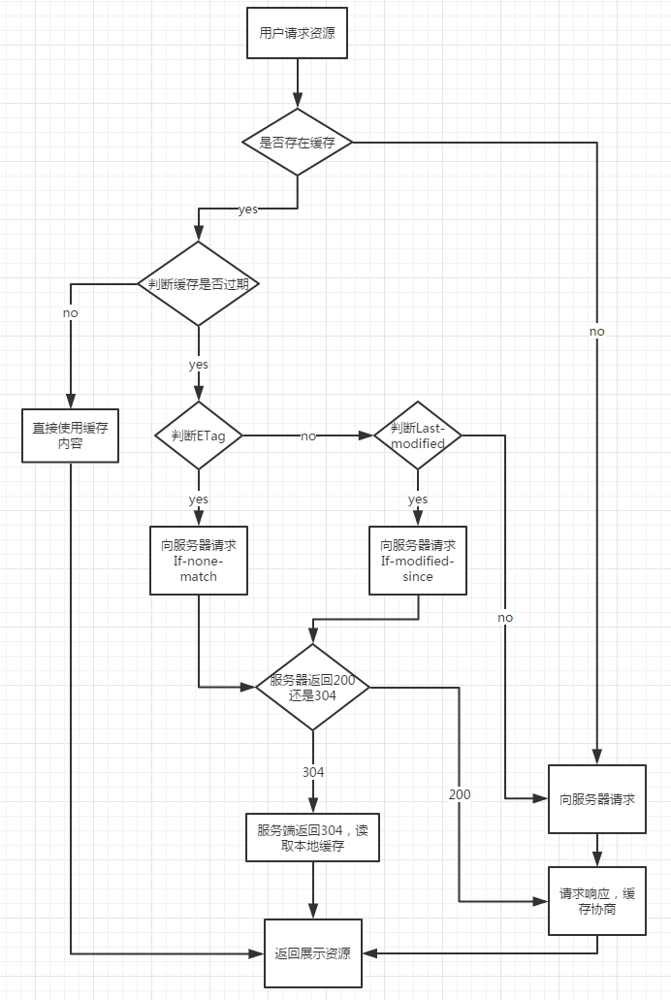
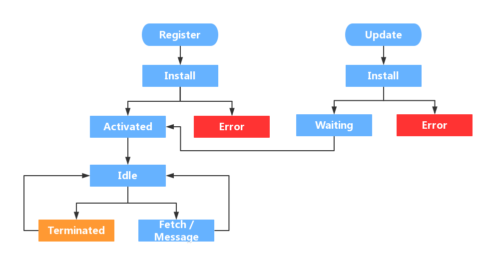

# HTTP

# 1. 响应头

## 1.1. Content-Disposition

主要用于告诉浏览器如何处理服务器返回的文件。当服务器返回一个文件的时候，浏览器默认会根据文件的 MIME 类型来决定如何处理。但是，如果服务器希望浏览器采取特定的行为，比如下载文件，就可以通过 `Content-Disposition` 来告诉浏览器采取什么行动
这个参数可以设置为 `inline`或者 `attachment`，前者表示直接在浏览器中打开文件，后者表示让浏览器下载文件

## 1.2. 缓存

### 1.2.1. 强缓存

- 在加载资源时，根据请求头中的`expires [http1.0]` 和 `cache-control [http1.1]` 值来判断是否命中强缓存，命中则直接从本地磁盘中读物资源
- expires
  <br>描述的是一个绝对时间，由服务端返回，会受到本地时间影响。通常表示如下：
  <br>Expires: Wed, 11 May 2018 07:20:00 GMT
- cache-control
  <br>描述的是一个相对时间，最大的缓存时间由服务端返回，通常表示如下：
  <br>Cache-Control: max-age=315360000 单位为秒
  <br>属性值还包括：
  - no-cache：会通过`etag`与服务端通信获取资源是否修改，如果没有修改则使用本地缓存，这意味着资源的访问至少存在与服务端有一次的通信
  - no-store：不缓存资源到本地
  - public：可被所有用户缓存，多用户进行共享，包括终端或 cdn 等中间代理服务器
  - private：表示相应资源仅仅能被获取他的浏览器端缓存，不允许任何中间者缓存响应的资源
  - s-maxage：与 max-age 类似，`s` 代表共享，一般仅用于`cdn`或者其他中间者。会覆盖`max-age` 和 `expires` 响应头

### 1.2.2. 协商缓存

- 如果强缓存步骤未命中，浏览器会发送请求到服务器，服务器通过请求头中的 `last-modified` 和 `etag`来验证是否命中协商缓存，如果命中则返回 `304` 状态码，不返回资源数据
- 协商缓存只要使用到两对响应头
  - last-modified 和 if-modified-since
    <br>`last-modified` 由上一次请求的响应头返回，且该值会在本次请求中通过 `if-modified-since` 传递给服务端，服务端通过对比服务端资源的修改时间与该值进行对比，如果在该值后资源有更新则返回最新的资源。但是存在资源修改时间改变，但是内容没变情况，通过修改时间对比不是最优，于是出现 etag
  - etag 和 if-none-match
    <br>etag 通过计算文件指纹，与请求传递的 if-none-match 对比，如果值不等，则返回新资源



> 💡etag 优先级比 last-modified 高

### 1.2.3. service worker

`service worker` 是浏览器与服务器之间的中间人角色，它可以拦截当前网站所有的请求



- 生命周期

  - register 注册 sw
  - installing 注册后，浏览器会执行安装，安装时，sw 就开始缓存文件，检查所有文件的缓存状态，如果都缓存了，就进入下一个状态
  - activated 如果是第一次加载 sw，在安装后，会直接进入激活阶段，如果是更新阶段，则流程如下：
    <br>已安装的为 A，新的版本为 B，B 进入 install 阶段，但是 A 还处于工作状态，所以 B 会一直处在 waiting 阶段，只有等 A 被 terminated 后，B 才能正常替代 A 的工作。terminated 时机有如下几种：

    - 关闭浏览器一段时间
    - 手动清除 sw
    - 在安装时跳过 waiting 阶段

    ```js
    self.addEventListener("install", (ev) => {
      self.skipWaiting();
    });
    ```

  - idle 空闲状态，浏览器会轮询释放处于该状态下的 sw 占用的资源
  - fetch 用于拦截代理所有指定的请求，并进行对应操作。对资源进行缓存在此阶段进行

  ```js
  self.addEventListener("fetch", (ev) => {
    ev.responseWith(
      caches.match(ev.request).then((res) => {
        if (res) {
          // 已经缓存，返回缓存内容
          return res;
        }
        return fetch(ev.request);
      })
    );
  });
  ```

- 如何使用？

  ```js
  // 注册sw
  ;(function () {
    if ('serviceWorker' in navigator) {
        navigator.serviceWorker.register('./sw.js')
    }
  })()
  ```

  ```js
  // sw.js
  // 监听安装阶段
  const CACHE_PREFIX = 'cms-sw-cache';
  const CACHE_VERSION = '0.0.20';
  const CACHE_NAME = CACHE_PREFIX+'-'+CACHE_VERSION;
  const allAssets = [
      './main.CSS'
  ];
  self.addEventListener('install',ev=>{
    self.skipWaiting()
    ev.waitUntil(
      caches.open(CACHE_NAME)
          .then(function(cache) {
              console.log('[SW]: Opened cache');
              return cache.addAll(allAssets);
          })
    );
  })

  // 激活时删除旧缓存
  function deleteOldCaches() {
    return caches.keys().then(function (keys) {
        const all = keys.map(function (key) {
            if (key.indexOf(CACHE_PREFIX) !== -1 && key.indexOf(CACHE_VERSION) === -1){
                console.log('[SW]: Delete cache:' + key);
                return caches.delete(key);
            }
        });
        return Promise.all(all);
    });
  }
  //sw激活阶段,说明上一sw已失效
  self.addEventListener('activate', function(event) {

      event.waitUntil(
          // 遍历 caches 里所有缓存的 keys 值
          caches.keys().then(deleteOldCaches)
      );
  });
  ```

### 2.1.4. 数据缓存

本地缓存操作库 [localforage](http://localforage.docschina.org/)
<br>indexedDB操作库 [Dexie.js](https://github.com/dexie/Dexie.js )
<br>serviceworker操作库 [workbox](https://github.com/GoogleChrome/workbox)

- cookie
<br>4K 可手动设置失效时间
- localStorage
<br>5M 需要手动清除
- sessionStorage
<br>5M 仅限当前标签访问，页面关闭即清除
- indexedDB
<br>无限 浏览器端数据库 需要手动清除

# 2. `HTTP` 版本

## 2.1. `HTTP2`

### 2.1.1. `HTTP1` 的问题

1. 队头阻塞
   <br>如果仅仅使用一个连接，它需要发起请求、等待响应，之后才能发起下一个请求。在请求应答过程中，如果出现任何状况，剩下所有的工作都会被阻塞在那次请求应答之后。这就是“队头阻塞”，它会阻碍网络传输和 Web 页面渲染，直至失去响应。为了防止这种问题，现代浏览器会针对单个域名开启 6 个连接，通过各个连接分别发送请求。它实现了某种程度上的并行，但是每个连接仍会受到“队头阻塞”的影响
2. 低效的 TCP 利用
   <br>`HTTP1` 并不支持多路复用，TCP 协议保证连接都能正常工作，但是不能保证它们的性能是最优的
3. 臃肿的消息首部
   <br>虽然`HTTP1`提供了压缩被请求内容的机制，但是消息首部却无法压缩
4. 受限的优先级设置
   <br>浏览器能指定优先级的方式是有限的：要么发起请求，要么不发起。浏览器为了先请求优先级高的资源，会推迟请求其他资源。但是优先级高的资源获取之后，在处理的过程中，浏览器并不会发起新的资源请求，所以服务器无法利用这段时间发送优先级低的资源，总的页面下载时间因此延长了
5. 第三方资源
   <br>很多第三方资源都不在`Web`开发者的控制范围内，所以很可能其中有些资源的性能很差，会延迟甚至阻塞页面渲染

### 2.1.2. `HTTP2` 特点

1. 二进制协议
   - 全面采用二进制格式而非文本格式
   - 方便机器解析，但是肉眼识别起来比较困难
2. 完全多路复用，而非有序并阻塞
   - 只需要一个连接即可实现并行
   - 提升 `TCP` 连接的利用率
3. 头部压缩
   - 首部被深度压缩
   - 显著减少传输中的冗余字节
4. 服务器可以将响应主动推送到客户端缓存中
   - 通过静态 `link` 标记资源
   - `http`头表示：`Link: </app/script.js>; rel=preload; as=script;nopush`
     - `rel` 表示资源是预加载的
     - `as` 表明资源类型
     - `nopush` 指示浏览器可能存在资源缓存，有推动能力的服务端不主动推送资源
       🚧

### 2.1.3. 开启`HTTP2`

1. `NGINX` 添加支持模块 `--with-http_v2_module`
2. 修改监听配置 `listen 443 ssl http2`
   🚧

## 2.2. `HTTP3`

🚧
