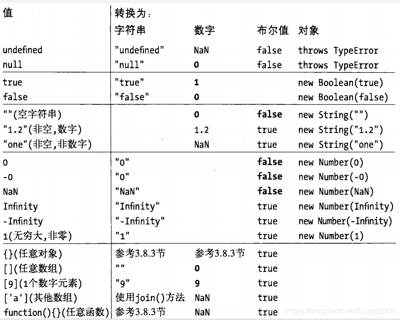

# JavaScript

## 1. 模块化规范

### 1.1. CommonJS

- 定义
  - 同步加载，模块加载完成才能继续执行后面的代码
  - 所有代码运行在模块作用域，不会污染全局
  - 模块可以多次加载，但是只在第一次加载时运行一次，之后的加兹安都引用缓存的结果。如果想再次运行，需要清除缓存
  - 加载顺序，按照在代码中出现的顺序加载，也可以动态加载
  - 导入的值是拷贝的，可以修改拷贝值，不会引起变量污染
- 基本语法
  - 暴露模块：module.exports = value || exports.xxx = value，exports 引用的其实是 module.exports
  - 引入模块：require(xxx)

### 1.2. AMD

- 定义

  - 非同步加载模块，允许指定回调函数

- 基本语法

  - 定义没有依赖的模块

    ```js
    define(function () {
      return xxx;
    });
    ```

  - 定义有依赖的模块

    ```js
    define(['module1','module2']。function(m1,m2){
      return xxx
    })
    ```

  - 引入模块，依赖前置

    ```js
    require(["m1", "m2"], function (m1, m2) {
      xxx;
    });
    ```

  - Eg：[require.js](https://github.com/requirejs/requirejs)

### 1.3. CMD

- 定义

  - 专门用于浏览器
  - 异步加载，使用时加载
  - 依赖就近

- 基本语法

  - 定义没有依赖的模块

    ```js
    define(function (resuire, exports, module) {
      exports.xxx = value;
      module.exports = value;
    });
    ```

  - 定义有依赖的模块

    ```js
    define(function(require,exports,module){
      // 同步引入
      let m1 = require('./module')
      // 异步引入
      require.async('./module',function(m2){
        ...
      })
    })
    ```

  - eg：[sea.js](https://github.com/seajs/seajs)

### 1.4. UMD

- 定义
  - JavaScript 通用模块，同时满足 CMD。AMD，CommonJS 标准

### 1.5. ESM

- 定义

  - 静态化
  - 编译时
  - 值引用

- 基本语法

  - 定义模块

    ```js
    export const xxx = value
    export {
     xxx:value,
      xxx:value
    }
    export default xxx
    ```

  - 引入模块

    ```js
    import { xxx } from "module"; // import concrete
    import a from "module"; // import default
    ```

## 2. This 指向

- 普通调用

```js
let obj = {
  a: 1,
  b: {
    a: 2,
    fn: function () {
      console.log(this.a);
    },
    catchFn() {
      console.log(this.a); // 可以捕获上层上下文，并且可以通过显示改变this指向
    },
    arrowFn: () => {
      console.log(this.a); // undefined this => window
    },
  },
};
obj.b.fn(); // 2
let j = obj.b.fn;
j(); // undefined this => window
obj.b.catchFn.call({ a: 3 }); // {a:3} 通过call，bind，apply改变this指向
```

- new 绑定
  - 在 js 中，new 的作用是通过构造函数来创建一个实例对象
  - new 过程发生了什么?
    1. 创建了一个空对象
    2. 将空对象原型的内存地址**proto**指向构造函数的原型对象
    3. 利用函数的 call 方法，将原本指向 window 的 this 指向新建的空对象
    4. 返回第三步的调用结果

    ```js
    function Foo(name) {
      this.name = name;
      return this;
    }
    function myNew(fn) {
      let obj = {};
      obj.__proto__ = fn.prototype;
      return fn.call(obj, "joe");
    }
    ```

```js
function Test() {
  this.x = 1;
}
let obj = new Test();
obj.x; // 1

如果构造函数中有return值，则this指向该值
如果return值是基础类型或者null，this仍然指向原实例对象
function Fn(){
    this.user = 'xxx'
    return {
        user:'joe'
    }
}
let newFn  = new Fn()
newFn.user // joe
```

## 3. Symbol

- 判断平台是否支持`Symbol`

```js
typeof Symbol === "function" && Symbol.for;
```

- Symbol(key) 直接调用会返回一个唯一的结果
- Symbol.for(key) 会在全局 symbol 注册表查找是否存在相同的 key，有则返回，没有则在 全局 symbol 注册表注册 key

```js
let a = Symbol("react");
let b = Symbol("react");
let c = Symbol.for("react");
let d = Symbol.for("react");
b === a; // false
c === d; // true
a === c; //false
```

## 4. 柯里化

`💡柯里化是一种函数式编程技术，将一个带有多个参数的函数转换为一系列只有一个参数的函数`

- 延长作用域链

```js
function curry(a) {
  return (b) => {
    return a + b;
  };
}
```

- 函数柯里化（洋葱圈模型）

```js
function compose(...args) {
  return args.reduceRight((pre, curr) => {
    return curr(pre);
  });
}
```

## 5. async defer prefetch preload

1. `async`立即下载（异步，不会阻塞文档解析），下载完立刻执行，无序
2. `defer`立即下载（异步，不会阻塞文档解析），文档解析完后立即执行，按照加载顺序执行
3. .`prefetch`预下载，在未来的某个页面可能会执行
4. `preload`预下载，需要的时候立即执行，

## 6. 运算符

### 6.1. 按位或 |

运算符在其中一个或两个数对应的围巾值位为`1`时，该值的结果为`1`

```js
cosnt a = 5/** *///00000000000000000000000000000101
const b = 3/** *///00000000000000000000000000000011
a | b/**       *///00000000000000000000000000000111
```

### 6.2. 按位或赋值 |=

按位或运算后赋值

```js
let a = 5; /***/ //00000000000000000000000000000101
a |= 3; /**   */ //00000000000000000000000000000011
a; /**        */ //00000000000000000000000000000111
```

### 6.3. 按位与 &

在两个操作数对应的二进位都为`1`时，该位的结果才为`1`

```js
const a = 5; /***/ //00000000000000000000000000000101
const b = 3; /***/ //00000000000000000000000000000011
a & b; /**      */ //00000000000000000000000000000001
```

### 6.4. 按位与赋值 &=

按位与运算后赋值

```js
const a = 5; /***/ //00000000000000000000000000000101
a &= 3; /**     */ //00000000000000000000000000000001
```

```js
function findMost(arr){
    let a = new Map()
    ;arr.forEach(item=>{
        a.set(item,(a.get(item) || 0)++)
    })
    return a
}
findMost([1,2,3,2,2,2,5,4,2])
```

## 7. 进程 & 线程

🚧

## 8. 浏览器渲染过程

## 9. == & ===

```js
基本类型：undefined、null、boolean、number、string
引用类型：Array、Object
包装类型：String、Number、Boolean
```

- 如果两个操作数都是数字类型，则直接进行数值比较。
- 如果两个操作数都是字符串类型，则按照字典顺序进行字符串比较。
- 如果一个操作数是数字类型，另一个操作数是字符串类型，则将字符串转换为数字后再进行比较。
- 如果两个操作数都是对象类型，则会调用它们的valueOf()或toString()方法来获取可比较的值，然后进行比较
- NaN和其他任何值都是不相等的，包括它本身


### 9.1. ==

双等号比较，如果两边类型不一样会尝试转换成基本类型进行比较

```js
// 对象比较
{a:1} == {a:1} //false 也会进行类型转换，但是转换会依然不会相等
{a:1} == 'object Object' // true 转换为字符串，调用.toString
'object Object' == {a:1} // false 尝试把字符串转换成对象
[] == true // false 都转换成数字类型 ‘’ == true => 0 == 1
[1] == true // true '1' == true => 1 == 1
[12] == true // false '12' == true => 12 == 1
{} == true // false  NaN == true
```

### 9.2 ===

全等比较，不进行类型隐式转换，引用类型比较地址，基本类型比较值

🚧

🚧 `持续更新` 🚧
